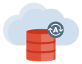

# Autonomous Database for Developers

This repository provides various demos using Spring Boot and a *Converged* Oracle Autonomous Database (you can get 2 databases for free [here](https://www.oracle.com/cloud/free/)).

 +  +  +  + 

## Demos
The following demos are presented in a logical order so it is preferable starting with demo 1, then demo 2, etc...
- [Demo 1 - Using the REST Enabled SQL Service to create a new database user](./sqlviarest)
- [Demo 2 - Connecting using Spring Boot JDBC](./connecting)
- [Demo 3 - Calling PL/SQL functions to manage database User Locks](./userlocks)
- [Demo 4 - Distinguishing the database consumer groups to use: what and when?](./dbconsumergroups)
- [Demo 5 - Generating AWR and ADDM reports in order to analyze performance](./awrreport)
- [Demo 6 - Using Advanced Queuing (transactional queues) to notify application with events](./transactionalqueue)
- [Demo 7 - Working with an Autonomous JSON database using `MongoRepository`](./mongodbapi)
- [Demo 8 - Auto-REST-enable tables (+loading, OAuth...)](./autorest)
- [Demo 9 - Spatial analytics with GeoJSON](./geojson)
- [Demo 10 - Working with JSON and Relational data together](./relationaljson)
- [Demo 11 - Always On Application](./alwaysonapp)

Each demo is a Maven module depending upon the `common` module.

## Setup
You'll need to set several environment variables to be able to run these examples, these are related to your Autonomous Database:
- region: the OCI region where the Autonomous Database has been provisioned
- database: the unique database name you want to connect to (see the `DB Connection` on the OCI console)
- database_ssl_cert_dn: the database SSL certificate (see the `DB Connection` on the OCI console)
- username: the username you want to connect to the Autonomous Database 
  (this will be the username that you'll create during [Demo 1](./sqlviarest) and use later on)
- password: the password to connect to the Autonomous Database

#### Example
- `export region=eu-marseille-1` (see [here for a list](https://docs.cloud.oracle.com/en-us/iaas/Content/General/Concepts/regions.htm#top))
- `export database=iq1ffzid3wfss2e_myatps`
- `export database_ssl_cert_dn="CN=adb.eu-marseille-1.oraclecloud.com, OU=Oracle ADB MARSEILLE, O=Oracle Corporation, L=Redwood City, ST=California, C=US"`
- `export username=demos`
- `export password=5uper_Pa55w0rd` set this as the same as the ADMIN user (see [here for password complexity 
  requirements](https://docs.oracle.com/en/cloud/paas/autonomous-database/adbsa/manage-users-create.html#GUID-72DFAF2A-C4C3-4FAC-A75B-846CC6EDBA3F))

### Requirements
Apart an Autonomous Database, you'll need a JDK 17 and Maven 3.X.

### How to run the demos?
Once the requirements are met, just clone the repo and build all the modules using Maven:
```
git clone https://github.com/loiclefevre/autonomous-database-for-developers.git
mvn install 
```

Then you can run a module by invoking the Spring Boot run target and specifying the module name (all of that inside the root directory, no need to change to any directory):
```
mvn spring-boot:run -pl <module name>
```
Example to run the Auto-REST demo, run:
```
mvn spring-boot:run -pl autorest
```

### Coming next...
In no particular order yet:
- Using Blockchain/Immutables tables
- Reactive R2DBC driver
- Understanding execution plans and session statistics
- Understanding the benefits for developers of the Autonomous database underlying infrastructure: Exadata
- Automatic partitioning unleashed
- Automatic indexing unleashed
- Applied Machine Learning on JSON data
- Property Graph Analytics with PGX and PGQL
- Using Oracle Machine Learning for Python using GraalVM
