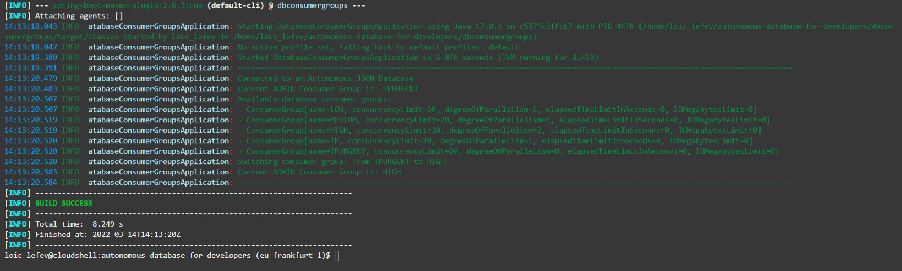

# Demo 4 - Distinguishing the database consumer groups to use: what and when?
`module dbconsumergroups`
- Using the Hikari connection pool with the ADMIN user
- Retrieving available database consumer groups
- Switching between database consumer groups using the `C##CLOUD$SERVICE.CS_SESSION.SWITCH_SERVICE()` stored procedure

### See also:
- [Manage Concurrency and Priorities on Autonomous Database](https://docs.oracle.com/en/cloud/paas/autonomous-database/adbsa/manage-priorities.html)

From the **documentation**:
The basic characteristics of these consumer groups are:

- TPURGENT: The highest priority application connection service for time critical transaction processing operations. This connection service supports manual parallelism.

- TP: A typical application connection service for transaction processing operations. This connection service does not run with parallelism.

- HIGH: A high priority application connection service for reporting and batch operations. All operations run in parallel and are subject to queuing.

- MEDIUM: A typical application connection service for reporting and batch operations. All operations run in parallel and are subject to queuing. Using this service the degree of parallelism is limited to four (4).
You can modify the MEDIUM service concurrency limit (this also changes the degree of parallelism). See Change MEDIUM Service Concurrency Limit for more information.

- LOW: A lowest priority application connection service for reporting or batch processing operations. This connection service does not run with parallelism.

