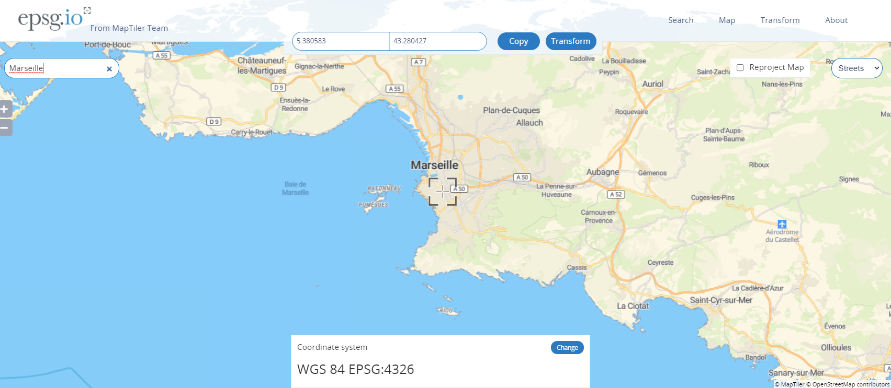

# Demo 9 - Spatial analytics with GeoJSON
`module geojson`
- Loads GeoJSON data (polygons of countries) into a JSON column using
- Creates Spatial index in order to use Spatial operators
- Query the countries containing the Marseille city using its EPSG:4326 coordinates

