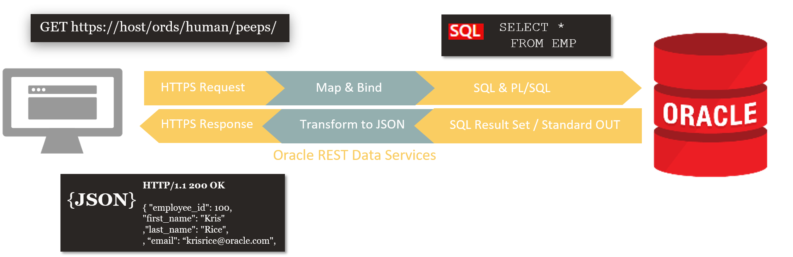
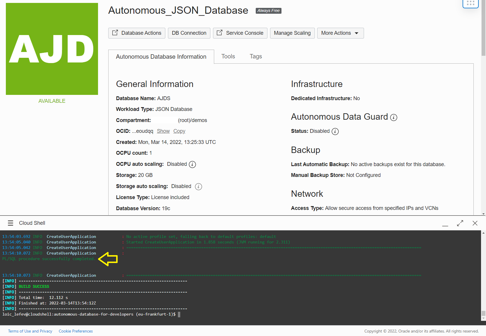

# Using the REST Enabled SQL Service to create a new database user
`module sqlviarest`
- WebClient synchronous call to the REST Enabled SQL Service powered by Oracle REST Data Services (aka ORDS)
- Basic Authentication using the ADMIN user account of the database
- JSON response mapping to a POJO

### See also:

- [Oracle REST Data Services - REST Enabled SQL Service](https://docs.oracle.com/en/database/oracle/oracle-rest-data-services/21.4/aelig/rest-enabled-sql-service.html)

