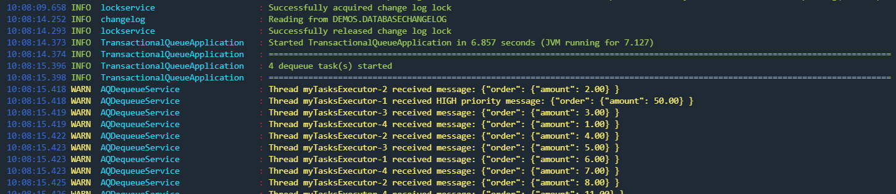

# Demo 6 - Using Advanced Queuing (aka AQ, transactional queues) to notify application with events
`module transactionalqueue`
- Advanced Queuing used to enqueue and dequeue JSON events without polling the database
- Events are transactional; it means you can modify data (DML) and send notification(s) **inside the very same transaction** without 2PC or XA
- Asynchronous dequeue service using default Spring `TaskExecutor`

